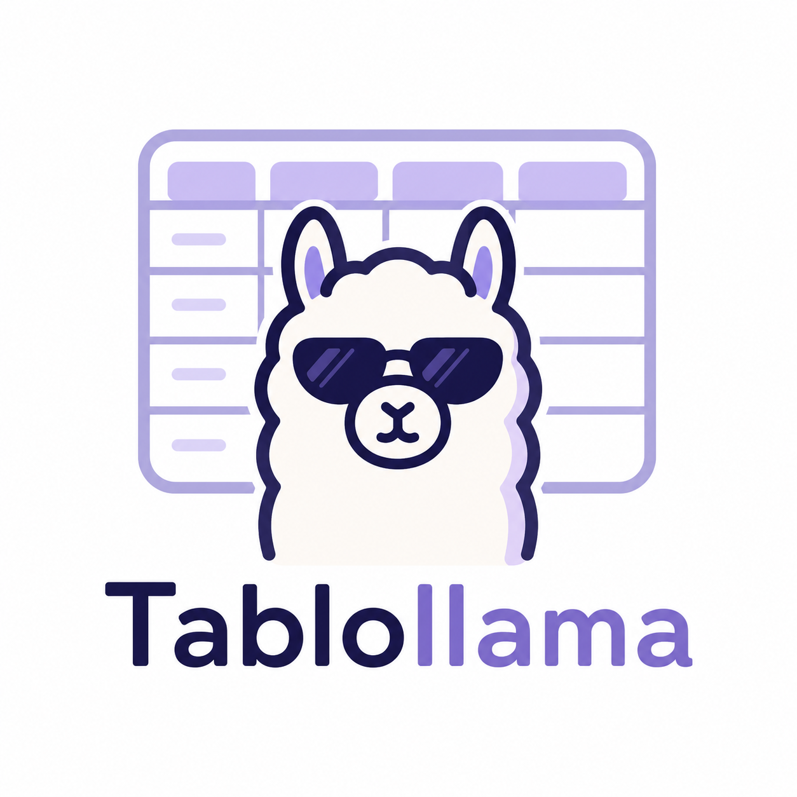
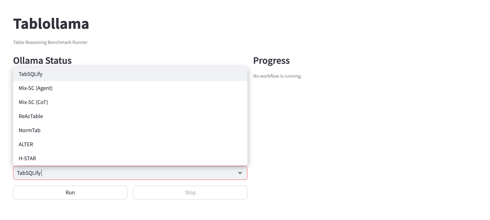
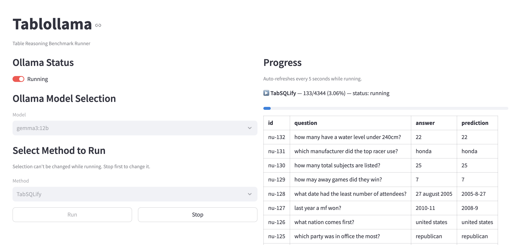

# Tablollama 
  
Local LLM Table QA Benchmark Pipeline

## What is this?

Tablollama evaluates table reasoning methods on the WikiTableQuestions (WikiTQ) dataset, powered
by locally-run open-source LLMs via [Ollama](https://ollama.com). It wraps 6
independent baselines behind one Airflow + MLflow + webapp stack, so you can trigger a run models without touching each baseline's own scripts by hand:

- **TabSQLify**
- **Mix-SC**
- **ReAcTable**
- **NormTab**
- **ALTER**
- **H-STAR**

**Not supported yet**: `chain-of-table`

## Prerequisites

- [Ollama](https://ollama.com) installed
  - `nomic-embed-text:latest` pulled — required for embeddings (used by ALTER)
  - Whichever model(s) you actually plan to run, pulled ahead of time (default: `llama3.2:1b`)
  - Start it with `OLLAMA_CONTEXT_LENGTH=24576 ollama serve` — the extended context length is
    needed for large tables
- [Docker](https://www.docker.com/) + Docker Compose, for the full webapp/Airflow/MLflow stack
- Python 3.11, if you'd rather run a baseline directly instead (see below)

## Project structure

```
TabSQLify/, ReAcTable/, NormTab/, ALTER/, H-STAR/, tablellm/   # each baseline's own code, unmodified interface
airflow_dags/                                                  # one DAG per baseline, orchestrates the above
mlflow_tracking/                                                # reads a baseline's result file, logs it to MLflow
webapp/                                                         # FastAPI backend + Streamlit frontend
docker-compose.yml                                              # Airflow + MLflow + webapp, one command
requirements.txt                                                # union of every baseline's real dependencies
```

## Run the full stack

```bash
OLLAMA_CONTEXT_LENGTH=24576 ollama serve   # on the host, once
docker compose up --build                  # Airflow + MLflow + webapp
```

Then open the webapp at `http://localhost:8501` to pick a model and a baseline and run it.

## Run a baseline directly

You don't need Docker or Airflow at all to just run one baseline — every baseline's real
dependencies are already collected in the root [`requirements.txt`](requirements.txt):

```bash
pip install -r requirements.txt
OLLAMA_CONTEXT_LENGTH=24576 ollama serve
cd TabSQLify && python run_wtq_full.py   # or any other baseline's own entrypoint
```

See [`README-airflow.md`](README-airflow.md) for how the Airflow/MLflow/webapp side is put together.

## Examples

<p align="center">
  
</p>
<p align="center">
  
</p>
